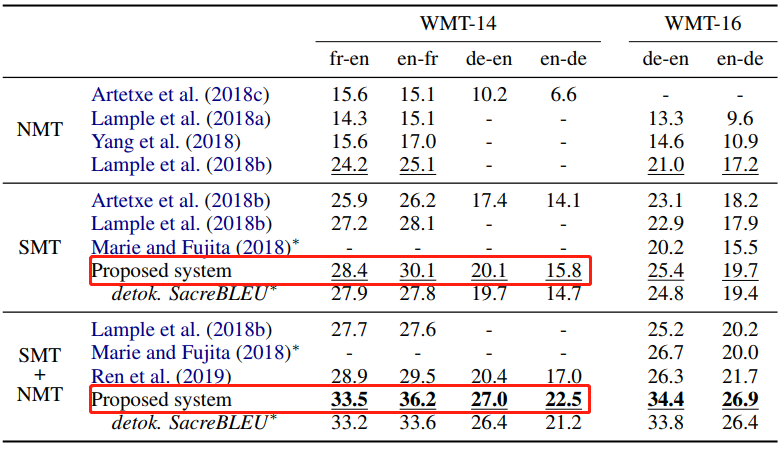

* [Origins](#origins)
* [Key issues](#key-issues)
* [Construct benchmark data](#construct-benchmark-data)
* [Problem dimensions](#problem-dimensions)
* [Performance overview](#performance-overview)
* [Initialization comparison](#initialization-comparison)
* [Reference](#reference)

---

### Origins

Motivation of [2], "take the low-resource challenge **to the extreme** and investigate whether it is possible to learn to translate even *without any* parallel data", and some other key words related to their method are:

> "maps into the same latent space" "learning to reconstruct from this shared feature space" "the model effectively learns to translate"

They think the usefulness of unmt is twofold:

- Practical usage: when encounter two-new language pair, we can quickly construct a baseline translation system in between;
- Sanity check usage: to provide *lower-bound* for any semi-supervised approach;

**Key ideas**

"The key idea is to build a common latent space between the two languages and to learn to translate by reconstructing in both domains according to *<u>two principles</u>*"

1. the model has to be able to reconstruct a sentence in a given language from a noisy version of it (**denoising autoencoder**) via MLE training;
2. the model also learns to reconstruct any source sentence given a noisy translation of the same sentence in the target domain, and vice versa (via MLE training, similar to back-translation);

- Constrain: constrain the source and target has the same latent space by using adversarial training on latent features.

After walking through the key ideas, one may have the following questions (as myself):

- For '2', how to find the noisy translation of a given source sentence $$x$$ as the target $$\hat{y}_{noise}$$;
- What is the latent feature space? Is it a vector space or a sequence of vectors? $$\Rightarrow$$ This Q relates to the parameterization of the neural model.

**Key ingredients**

- **Word-by-word translation model**: via <u>a parallel dictionary</u> learned in an unsupervised way using [9], the target order is as the same as the source word (?).
  - the word-by-word translation model is used at the first iteration, where we can obtain corresponding sources or targets for each target and source in the monolingual corpus respectively, and use them as the noisy translation.
- **Noisy source** (Noise model $$C$$): dropping and swapping words "both of which turned out to have a critical impact on the results"; $$C(x)$$ denotes the corrupted version of $$x$$;
  - $$p_{wd}$$: the probability of word drop independently for each $$x_i$$; $$p_{wd} = 0.1$$
  - $$\forall i \in \{1, n\}, \vert \sigma(i) - i \vert \leq k$$, with $$k=3$$

**Hybrid training**

The training of the unmt model consists of three elements:

1. **Denoising autoencoding**
   - MLE on $$x \in \mathcal{D}_l$$, with the corrupted source $$C(x)$$: $$\log p(x \vert C(x); \theta)$$
2. **Cross-domain training**
   - MLE on reconstruction from **corrupted** translated target generated by model from previous iteration: $$\log p(x \vert C(\hat{y}))$$, where $$\hat{y} = \mathcal{M}(x)$$
3. **Adversarial training**
   - Adversarial training on encoder's hidden representation to entangle representations from $$l_1$$ and $$l_2$$ so that representation with similar semantics can better come close to each other: 
     - Discriminator: $$\log p(l_i \vert e(x^{l_i}); \theta)$$
     - Generator (the encoder of the unmt model $$e$$): $$\log p(l_i \vert e(x^{l_{\neg i}}); \theta_e)$$

So the final objective is the following is denoted as Eq. (4):

$$
\mathcal{L}(\theta_e, \theta_d, \mathcal{Z}) = \lambda_{auto} \mathcal{L}_{auto}(\theta_{e}, \theta_{d}, \mathcal{Z}; src) + \lambda_{cd} \mathcal{L}_{cd}(\theta_{e}, \theta_{d}, \mathcal{Z}; src \Rightarrow tgt) + \lambda_{cd} \mathcal{L}_{cd}(\theta_{e}, \theta_{d}, \mathcal{Z}; tgt \Rightarrow src) + \lambda_{adv} \mathcal{L}(\theta_{e}, \mathcal{Z} \vert \theta)
$$

<u>What is one iteration?</u>

- After obtaining the word-to-word translation model, we denote it as $$M^{(1)}$$; via it, we translate all the monolingual data in $$\mathcal{D}_{l_1}$$ and $$\mathcal{D}_{l_2}$$, and
  - firstly, train the adversarial's Discriminator, sample $$x \in \mathcal{D}_{l_1}$$, $$y \in \mathcal{D}_{l_2}$$ for training the D to recognize each language;
  - sample $$x \in \mathcal{D}_{l_1}$$, $$y  \in \mathcal{D}_{l_2}$$ for constructing denoising autoencoding loss;
  - sample $$(x \in \mathcal{D}_{l_1}, \hat{y}=M^{(i)}(x)$$ and $$(y \in \mathcal{D}_{l_2}, \hat{x}=M^{(i)}(y))$$ for constructing cross-domain alignment loss;
  - sample $$x \in \mathcal{D}_{l_1}$$ and $$y \in \mathcal{D}_{l_2}$$ for constructing loss for the encoder;

> The intuition of the algorithm is given by the authors as:
>
> "as long as the initial translation model $$M^{(1)}$$ (the word-by-word translation model) retains at least some information of the input sentence, the encoder will map such translation into a representation in feature space that also corresponds to a clearer version of the input, since the encoder is trained to denoise. At the same time, the decoder is trained to predict noiseless outputs, conditioned on noisy features. Putting these two pieces together will produce less noisy translations, which will enable better back-translation at the next iteration, and so on so forth."

**Model selection**

The insight is the reconstruction BLEU can somehow reflect of the model's competence, that is the translation should preserve semantics of $$x$$ so that the back-translation can better match the semantics of $$x$$ itself:

$$MC(e, d, \mathcal{D}_{l_1}, \mathcal{D}_{l_2}) = \frac{1}{2} \mathbb{E}_{x \sim \mathcal{D}_{l_1}}[ \text{BLEU}(x, M_{l_1 \rightarrow l_2} \circ M_{l_2 \rightarrow l_1}(x) ) ] + \frac{1}{2} \mathbb{E}_{y \sim \mathcal{D}_{l_2}} [ \text{BLEU} (y, M_{l_2 \rightarrow l_1} \circ M_{l_1 \rightarrow l_2}(y))]$$

**Ablation is very interesting**

Here you can see that:

- If the initialization of embedding is from cross-lingual pre-trained ones, the results make sense even if training without self-training (with bilingual psudo data);
- or if with random initialization of embedding, but with word-to-word translation as for initial self-training, we can abandon the pre-trained cross-lingual word embedding;

Some **intuitions** demystified:

Q1. I used to think that adversarial training is important, since that is where alignment of similar semantic groups from different languages happens; however, the denoising process seems to have a bigger effect on 

Q2. Denoising autoencoding loss can be compensated with cross-domain loss in terms of learning better language modeling (prior) for the decoder $$\Rightarrow$$ that is, why there is small drop of performance if we mask one of them (see the $$\lambda_{cd} = 0$$ and $$\lambda_{auto}$$ rows)

---

### Ablation studies

In this part, I would like to focus on several ablation studies conducted in the follow-up works.

- Ablation study for neural models in [3]

---

### Key issues

1. Initial translation model (does all works use the initial word-by-word translation model to kick start the back-translation psudo bilingual corpus, if not how stable are they?)

2. Denoising autoencoding and back-translation loss are not critical in [2], but critical in [3], why?

3. Adversarial loss is deprecated since [3], why?
4. Why pre-training that important? Some possible reasons?
   - They shape the representations of similar meanings (in different language with similar representations or similar manifold structure)
5. etc.

---

### Construct benchmark data

This part review how the two papers [1] and [2] construct their benchmark data for training and evaluation.

**Data setting in [2]**

> "We use the full training set of 36 million pairs, we lower-case them and remove sentences longer than 50 words, as well as pairs with a source/target length ratio above 1.5, resulting in a parallel corpus of about 30 million sentences."
>
> "Next, we build monolingual corpora by selecting English sentences from 15 million random pairs, and selecting the French sentences from the complementary set. The former set constitutes our English monolingual dataset. The latter set is our French monolingual dataset."
>
> "**The lack of overlap between the two sets ensures that there is not exact corresponding between examples in the two datasets.**"
>
> "The validation set is comprised of 3,000 English and French sentences extracted from our monolingual training corpora described above. These sentences are not the translation of each other, and they will be used by our unsupervised model selection criterion [...]."
>
> "Finally, we report results on the full *newstest2014* dataset."

**Data setting in [1]**

> "We make our experiments comparable with previous work by using the French-English and German-English datasets from the WMT 2014 shared task."

---

### Problem dimensions

1. Use BPE or not?
2. Use adversarial loss or not?
3. Use pre-trained emb or not?
   - separate train or concat train?
4. Use pre-trained enc/dec or not?
   - use what 
5. Use PBSMT or not?

| Paper | use BPE | use Adv. loss | use Pre-trained emb | use Pre-trained enc/dec | use PBSMT | use word-by-word translation model |      |
| ----- | ------- | ------------- | ------------------- | ----------------------- | --------- | ---------------------------------- | ---- |
| [1]   | no/yes  | no            | yes                 | no                      | no        | no                                 |      |
| [2]   | no      | yes           | yes                 | no                      | no        | yes                                |      |
| [3]   | yes     | no            | yes                 | no                      | yes       | no                                 |      |
| [4]   | yes     | no            | yes                 | yes                     | no        | no                                 |      |
| [10]  | yes     | no            | yes                 | yes                     | no        | no                                 |      |

---

### Performance overview

1. Performance in [2]

  

2. Performance in [3]

   

3. Performance in [6]

   

4. Performance in [4]

   

5. Performance in [10]

   

---

### Initialization comparison

This part focuses on how <u>[1] [2]</u>; <u>[3] [6] [7]</u>; <u>[4] [10] [15]</u> initializes the embedding or enc/dec of the seq2seq (LSTM or Transformer) model.

- [1], [2] as the first attempt for unsupervised mt

  - [1]

    - > "Given that the proposed system uses pre-trained cross-lingual embeddings in the encoder as described in Section 3.1, we use the monolingual corpora described above to independently train the embeddings for each language using word2vec. More concretely, we use the skip-gram model with ten negative samples, a context window of ten words, 300 dimensions, a sub-sampling of $$10^{-5}$$, and ten training iterations. We then use the public implementation of the method proposed by Artetxe et al. (2017) to map these embeddings to a shared space, using the recommended configure with numeral-based initialization."

  - [2]

    - > "To implement our baseline and also to initialize the embeddings $$\mathcal{Z}$$ of our model, we first train word embeddings <u>on the source and target monolingual corpora</u> using fastText, and then we apply the unsupervised method proposed by Conneau et al. (2017) to infer a bilingual dictionary which can be use for word-by-word translation."

    - These monolingual corpora might be the data used for *training*; that is, the huge `news commoncrawl` data is not used.

- [3], [6], [7] as the second attempt to standardize the essential components

  - [3]

    - > "First, instead of considering words, we consider BPE which have two major advantages: they reduce the vocabulary size and they eliminate the presence of unknown words in the output translation. Second, instead of learning an explicit mapping between BPEs in the source and target languages, we define BPE tokens by jointly processing both monolingual corpora."
      >
      > "In practice, we i) join the monolingual corpora; ii) apply BPE tokenization on the resulting corpus, and iii) learn token embeddings on the same corpus, which are used to **initialize** the lookup tables in the encoder and decoder."

  - [6] **[XXX]**, they do not use any initialization method for NMT systems, they just use the two SMT systems to warmup the NMT systems through BT procedures.

  - [7] **[XXX]**, it seems that in their paper, we cannot read out the fact that they use pretrained techniques to initialize any part of the NMT system.

- [4], [10], [15] as the recent advances on focusing on initializations (pre-training)

  - [4]

    - > "We use WikiExtractor to extract raw sentences from Wikipedia dumps and use them as monolingual data for the CLM and MLM objectives. [...] We use fastBPE  to learn BPE codes and split words into subwords units. The BPE codes are learned on the concatenation of sentences sampled from all languages, following the method presented in Section 3.1."

    - > [On this github link](https://github.com/facebookresearch/XLM#pretrained-cross-lingual-language-models), authors said that:
      >
      > "We provide large pretrained models for the 15 languages XNLI, and two other models in 17 and 100 languages."

  - [10], based on the codebase of [4].

    - > "We use all of the monolingual data from WMT News Crawl datasets, which covers 190M, 62M and 270M sentences from year 2007 to 2017 for English, French, German respectively. [...] We use all of the available Romanian sentences from News Crawl dataset and augment it with WMT16 data, which results in 2.9M sentences. We remove the sentences with length over 175. For each task, we jointly learn a 60,000 sub-word units with BPE between source and target languages."
      >
      > "Different from Artetxe et al. (2017); Lample et al. (2017, 2018); Leng et al. (2019), we just use back-translation to generate pseudo bilingual data for training, without using denoising auto-encoder" (see Table 3 for detailed comparison)

  - [15], based on the codebase of [4].

    - > "In our experiments, we consider three language pairs, English-French (en-fr), English-German (en-de) and English-Romanian (en-ro). For each language, we use all the available sentences in NewsCrawl till 2018, monolingual datasets from WMT. The NewsCrawl data are used in both pre-training and the following unsupervised NMT iteration process."

---

### Reference

[1] [Unsupervised Neural Machine Translation](https://arxiv.org/abs/1710.11041), ICLR 2018.

[2] [Unsupervised Machine Translation Using Monolingual Corpora Only](https://openreview.net/pdf?id=rkYTTf-AZ), ICLR 2018.

[3] [Phrase-Based & Neural Unsupervised Machine Translation](https://www.aclweb.org/anthology/D18-1549.pdf), EMNLP 2018.

[4] [Cross-lingual Language Model Pretraining](https://arxiv.org/pdf/1901.07291.pdf), arXiv Jan. 2019.

[5] [Unsupervised Statistical Machine Translation](https://arxiv.org/pdf/1809.01272.pdf), EMNLP 2018.

[6] [An Effective Approach to Unsupervised Machine Translation](https://arxiv.org/pdf/1902.01313.pdf), ACL 2019.

[7] [Unsupervised Neural Machine Translation with SMT as Posterior Regularization](https://arxiv.org/abs/1901.04112), AAAI 2019.

[8] [Polygon-Net: A General Framework for Jointly Boosting Multiple Unsupervised Neural Machine Translation Models](https://www.ijcai.org/proceedings/2019/0739.pdf), IJCAI 2019. (submitted around Sep. 2018)

[9] [Word Translation Without Parallel Data](https://arxiv.org/abs/1710.04087), ICLR 2018.

[10] [MASS: Masked Sequence to Sequence Pre-training for Language Generation](https://arxiv.org/pdf/1905.02450.pdf), ICML 2019.

[11] [Unsupervised Statistical Machine Translation](https://arxiv.org/pdf/1809.01272.pdf), arXiv Sep. 2018.

[12] [The Missing Ingredient in Zero-Shot Neural Machine Translation](https://arxiv.org/pdf/1903.07091.pdf), arXiv Mar. 2019, Google AI.

[13] [Hard but Robust, Easy but Sensitive: How Encoder and Decoder Perform in Neural Machine Translation](https://arxiv.org/pdf/1908.06259.pdf), arXiv Aug. 2019. MSRA.

[14] [Can Unconditional Language Models Recover Arbitrary Sentences?](http://papers.nips.cc/paper/9661-can-unconditional-language-models-recover-arbitrary-sentences.pdf), NeurIPS 2019. Cho and Bowman's group.

[15] [Explicit Cross-lingual Pre-training for Unsupervised Machine Translation](https://arxiv.org/pdf/1909.00180.pdf), EMNLP 2019. Shuo Ren.

[16] [Consistency by Agreement in Zero-shot Neural Machine Translation](https://arxiv.org/pdf/1904.02338.pdf), EMNLP 2019.

[17] [Do We Really Need Fully Unsupervised Cross-Lingual Embeddings?](https://arxiv.org/pdf/1909.01638.pdf), arXiv Sep. 4 2019.

[18] [Latent Space Secrets of Denoising Text-Autoencoders](https://arxiv.org/pdf/1905.12777.pdf), arXiv May 29 2019. MIT.

[19] [Emerging Cross-lingual Structure in Pretrained Language Models](https://arxiv.org/pdf/1911.01464.pdf), EMNLP 2019.

[20] [A Survey of Cross-lingual Word Embedding Models](https://jair.org/index.php/jair/article/view/11640/26511), JAIR 2019.

[21] [Unsupervised Cross-lingual Representation Learning at Scale](https://arxiv.org/pdf/1911.02116.pdf), arXiv Nov. 5 2019. Facebook AI.