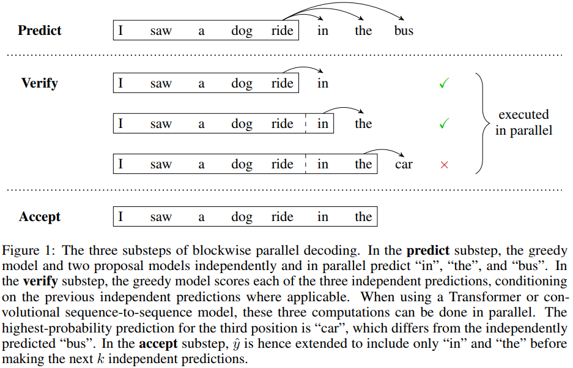
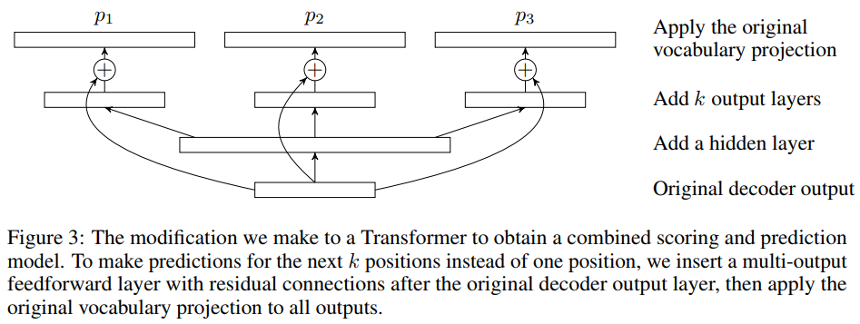
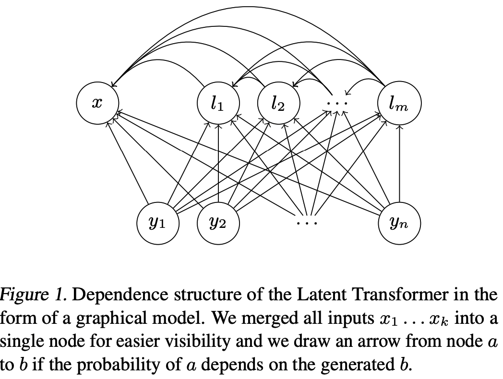
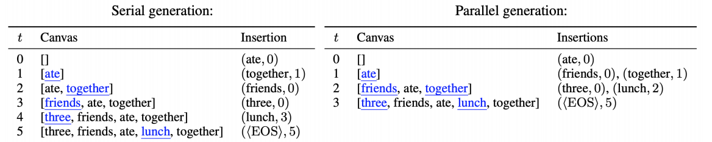
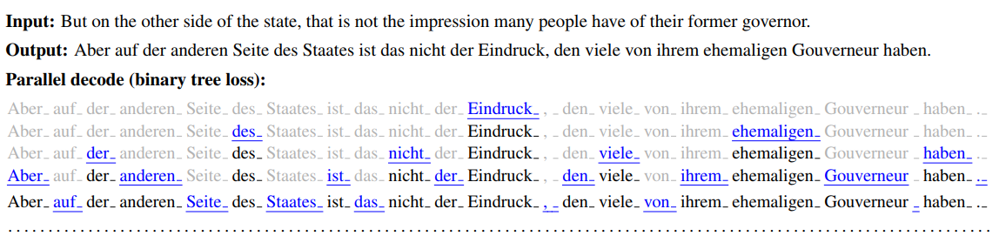
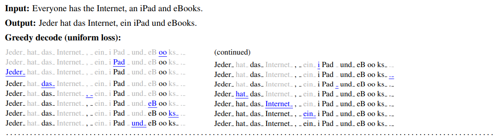
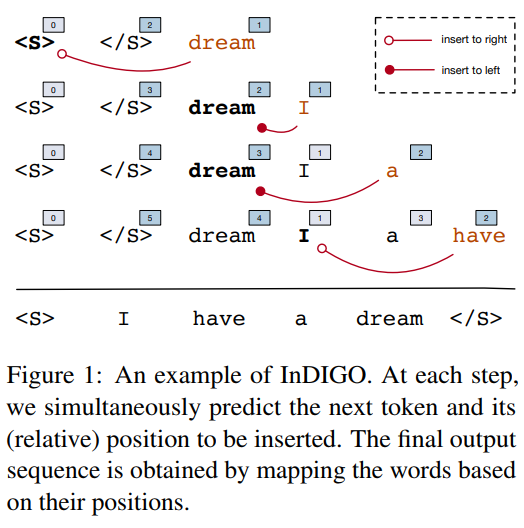
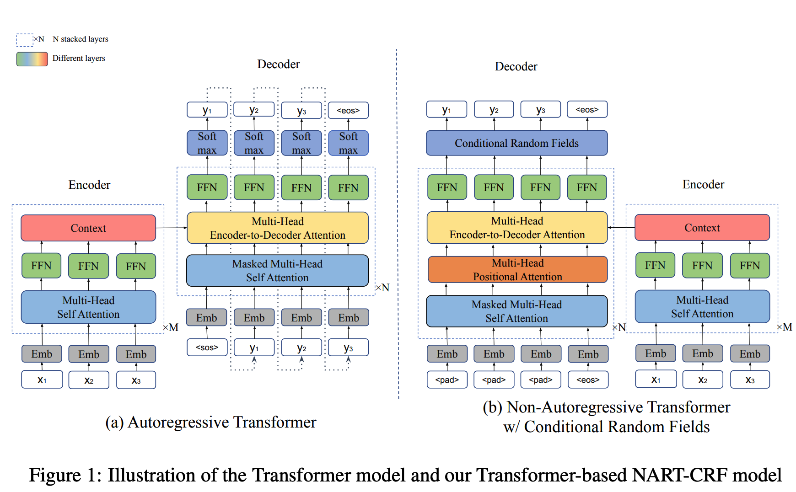

> Today, let's zoom in the world of unrestricted label-dependency modelling, to find motivations for probable theory of search/model error trade-off.

* [Papers in summary](#papers-in-summary)
  * [The original paper](#the-original-paper)
  * [Block-wise modeling](#block-wise-modeling)
  * [Insertion-based modeling](#insertion-based-modeling)
  * [Structured inference](#structured-inference)
* [Reference](#reference)

### Papers in summary

#### The original paper

[Non-Autoregressive Neuran Machine Translation](https://arxiv.org/pdf/1711.02281.pdf) (ICLR 2018) is the recent *biggest* (for me) innovations in Neural Machine Translation (NMT). It is a new modelling approach for the label dependency of NMT, which in essence assumes no label depedency among target words. This can accelerate inference time or decoding about several times faster than the classic auto-regressive counter part, and can potentially resolve several issues regarding auto-regressive structure, such as **exposure bias**.

> Note that, the implementation of several papers as well as the this original paper and the newest Levenstein Transformer are all implemented [here](https://github.com/pytorch/fairseq/tree/master/fairseq/models/nat) in `fairseq`.

$$
p_{\mathcal{N}\mathcal{A}} = 
\sum_{f_1, f_2, \dots, f_{T'}}
\Bigg(
\Pi_{t'=1}^{T'} p_F (f_{t'} \vert x_{1:T'}; \theta)
\cdot
\Pi_{t=1}^{T} p(y_t \vert x_1 \{f_1\}, \dots, x_{T'} \{f_{T'}\})
\Bigg)
$$

The above equation is the factorized probabilistic model for the translation conditional $$p(y \vert x)$$. For inference, the author define:

$$Y = G(x_{1:T'}, f_{1:T'})$$

to represent the optimal translation given a source sentence and a sequence of fertility values. And since marginalizing all the fertility sequences is intractable, so the authors adopt three strategies:

- $$\arg\max$$ inference under the fertility model $$p_{F}(f_{t'} \vert x_{1:T'}; \theta)$$;
- $$\text{avg}$$ inference over the fertility model;
- **Noisy parallel decoding (NPD)**: add noise to sampling $$s \in \{10, 100\}$$ different fertility sequences, and then choose the one with largest $$\Pi_{t=1}^{T} p(y_t \vert x_1\{f_1\}, \dots, x_{T'}\{f_{T'}\})$$ value.

The actual training loss are two terms emerges using variational inference to approximate the over the above equation via a proposal distribution $$q(f_{t'} \vert x_{1:T'}, y_{1:T})$$ which can reach the information from both source and target.

$$
\begin{align}
\log \sum_{f_{1:T'} \sim p_F(f_{1:T'} \vert x_{1:T'}; \theta)} p(y_{1:T} \vert f_{1:T'}, x_{1:T'}; \theta) &= \log \sum_{f_{1:T'} \sim q(f_{1:T'} \vert x_{1:T'}, y_{1:T})} p(y_{1:T} \vert f_{1:T'}, x_{1:T'}) \frac{p_F}{q} \\
& \geq \mathbb{E}_{q} (\log p + \log p_F/q) \\
& = \sum_{f_{1:T'} \sim q} \log p(y_{1:T} \vert x_{1:T'}, f_{1:T'}; \theta) + \sum_{f_{1:T'} \sim q} \log p_F(f_{1:T'} \vert x_{1:T'}; \theta) + \mathcal{H}[q] 
\end{align}
$$

**Sequence-level Knowledge Distillation**

To reduce dataset modality (one-to-many for specific), sequence-level knowledge distillation is used to construct a new corpus by training an autoregressive machine translation model, known as the teacher, to greedily outputs the target for each source training example.

> "The resulting targets are less noisy and more deterministic, as the trained model will consistently translate a sentence like 'Thank you.' into the same German translation every time."

For a better understanding of the important role of knowledge distillation in NAT training, Jiatao's group has another paper [7] submitted to ICLR 2020.

[TO-DO: a brief summary of that paper]

**Fine-tuning with word-level distillation**

This process is conducted for improving the coupling (cooperation) between the fertility model and the translation model by exposing to the fertility model's own action sequence. The reward signal is measured by the following loss term:

$$
\mathcal{L}_{\text{RKL}} (f_{1:T'}; \theta)
=
\sum_{t=1}^{T} \sum_{y_t} \log p_{\mathcal{AR}} (y_t \vert x, \hat{y}_{1:t-1})
\cdot
p_{\mathcal{NA}}(y_t \vert x, \hat{y}_{1:t-1})
$$

Since $$\hat{y}$$ is generated by the non-autoregressive model, so evaluation on it like the word-level cross-entropy can measure the usefulness of the fertility sequence with in terms of generating sequence similar to the autoregressive model. Here the authors still do not use the original reference $$y^*$$ to calculate reward, still due to the modality consideration. For controlling variance, a baseline is also introduced which is the expected fertility sequence predicted through averaging.

---

Let us see the code for detailed implementation. The naive `nonautoregressive_transformer` (`NATransformerModel`) model is inherited from `FairseqNATModel`, which is also inherited from `TransformerModel`.

```python
NATransformerModel
-> FairseqNATModel
-> TransformerModel
-> FairseqEncoderDecoderModel
-> BaseFairseqModel
-> nn.Module
```

The `NATransformerModel` is built through the `def build_model()` function in `TranslationLevenshsteinTask -> TranslationTask -> FairseqTask`, which calls the `def build_model()` function in the `models` folder (python module), which in the end calls the `def build_model()` function in `TransformerModel`. This creates the encoder and decoder separately.

```python
# fairseq/tasks/fairseq_tasks.py
def build_model(self, args):
    """
    Build the :class:`~fairseq.models.BaseFairseqModel` instance for this
    task.
    Args:
        args (argparse.Namespace): parsed command-line arguments
    Returns:
        a :class:`~fairseq.models.BaseFairseqModel` instance
    """
    from fairseq import models
    return models.build_model(args, self)

# fairseq/models/__init__.py
def build_model(args, task):
    return ARCH_MODEL_REGISTRY[args.arch].build_model(args, task)

# fairseq/models/nat/transformer.py
	@classmethod
    def build_model(cls, args, task):
        """Build a new model instance."""

        # make sure all arguments are present in older models
        base_architecture(args)

        if args.encoder_layers_to_keep:
            args.encoder_layers = len(args.encoder_layers_to_keep.split(","))
        if args.decoder_layers_to_keep:
            args.decoder_layers = len(args.decoder_layers_to_keep.split(","))

        if getattr(args, 'max_source_positions', None) is None:
            args.max_source_positions = DEFAULT_MAX_SOURCE_POSITIONS
        if getattr(args, 'max_target_positions', None) is None:
            args.max_target_positions = DEFAULT_MAX_TARGET_POSITIONS

        src_dict, tgt_dict = task.source_dictionary, task.target_dictionary

        def build_embedding(dictionary, embed_dim, path=None):
            num_embeddings = len(dictionary)
            padding_idx = dictionary.pad()
            emb = Embedding(num_embeddings, embed_dim, padding_idx)
            # if provided, load from preloaded dictionaries
            if path:
                embed_dict = utils.parse_embedding(path)
                utils.load_embedding(embed_dict, dictionary, emb)
            return emb

        if args.share_all_embeddings:
            if src_dict != tgt_dict:
                raise ValueError('--share-all-embeddings requires a joined dictionary')
            if args.encoder_embed_dim != args.decoder_embed_dim:
                raise ValueError(
                    '--share-all-embeddings requires --encoder-embed-dim to match --decoder-embed-dim')
            if args.decoder_embed_path and (
                    args.decoder_embed_path != args.encoder_embed_path):
                raise ValueError('--share-all-embeddings not compatible with --decoder-embed-path')
            encoder_embed_tokens = build_embedding(
                src_dict, args.encoder_embed_dim, args.encoder_embed_path
            )
            decoder_embed_tokens = encoder_embed_tokens
            args.share_decoder_input_output_embed = True
        else:
            encoder_embed_tokens = build_embedding(
                src_dict, args.encoder_embed_dim, args.encoder_embed_path
            )
            decoder_embed_tokens = build_embedding(
                tgt_dict, args.decoder_embed_dim, args.decoder_embed_path
            )

        encoder = cls.build_encoder(args, src_dict, encoder_embed_tokens)
        decoder = cls.build_decoder(args, tgt_dict, decoder_embed_tokens)
        return cls(args, encoder, decoder)
```

The `FairseqNATEncoder` and `FairseqNATDecoder` classes are listed as follows:

```python
# Encoder
class FairseqNATEncoder(TransformerEncoder):
    def __init__(self, args, dictionary, embed_tokens):
        super().__init__(args, dictionary, embed_tokens)
        self.ensemble_models = None

    @ensemble_encoder
    def forward(self, *args, **kwargs):
        return super().forward(*args, **kwargs)

# decoder
class FairseqNATDecoder(TransformerDecoder):
    def __init__(self, args, dictionary, embed_tokens, no_encoder_attn=False):
        super().__init__(args, dictionary, embed_tokens, no_encoder_attn)
        self.ensemble_models = None

# NATransformerDecoder
class NATransformerDecoder(FairseqNATDecoder):\
    # ...
    
	@ensemble_decoder
    def forward(self, normalize, encoder_out, prev_output_tokens, step=0, **unused):
        features, _ = self.extract_features(
            prev_output_tokens,
            encoder_out=encoder_out,
            embedding_copy=(step == 0) & self.src_embedding_copy,
        )
        decoder_out = self.output_layer(features)
        return F.log_softmax(decoder_out, -1) if normalize else decoder_out
    
    def extract_features(
        self,
        prev_output_tokens,
        encoder_out=None,
        early_exit=None,
        embedding_copy=False,
        **unused
    ):
        """
        Similar to *forward* but only return features.
        Inputs:
            prev_output_tokens: Tensor(B, T)
            encoder_out: a dictionary of hidden states and masks
        Returns:
            tuple:
                - the decoder's features of shape `(batch, tgt_len, embed_dim)`
                - a dictionary with any model-specific outputs
            the LevenshteinTransformer decoder has full-attention to all generated tokens
        """
        # embedding
        if embedding_copy:
            src_embd = encoder_out.encoder_embedding
            src_mask = encoder_out.encoder_padding_mask
            src_mask = (
                ~src_mask
                if src_mask is not None
                else prev_output_tokens.new_ones(*src_embd.size()[:2]).bool()
            )

            x, decoder_padding_mask = self.forward_embedding(
                prev_output_tokens,
                self.forward_copying_source(
                    src_embd, src_mask, prev_output_tokens.ne(self.padding_idx)
                ),
            )

        else:

            x, decoder_padding_mask = self.forward_embedding(prev_output_tokens)

        # B x T x C -> T x B x C
        x = x.transpose(0, 1)
        attn = None
        inner_states = [x]

        # decoder layers
        for i, layer in enumerate(self.layers):

            # early exit from the decoder.
            if (early_exit is not None) and (i >= early_exit):
                break

            x, attn = layer(
                x,
                encoder_out.encoder_out if encoder_out is not None else None,
                encoder_out.encoder_padding_mask if encoder_out is not None else None,
                self_attn_mask=None,
                self_attn_padding_mask=decoder_padding_mask,
            )
            inner_states.append(x)

        if self.layer_norm:
            x = self.layer_norm(x)

        # T x B x C -> B x T x C
        x = x.transpose(0, 1)

        if self.project_out_dim is not None:
            x = self.project_out_dim(x)

        return x, {"attn": attn, "inner_states": inner_states}
```

As you can see, they are nothing but the *original* Transformer's encoder and decoder.

The `forward` function in `class NATransformerModel` is as follows:

```python

```


#### Block-wise modeling

[Blockwise Parallel Decoding for Deep Autoregressive Models](https://papers.nips.cc/paper/8212-blockwise-parallel-decoding-for-deep-autoregressive-models.pdf) (NeurIPS 2018), comes after Jiatao Gu's work, and also focuses on the modelling of target word dependency or label dependency. Their main claimed contribution is *also* speed.

> "This allows for substantial theoretical improvements in generation speed when applied to architectures that can process output sequence in parallel."

Their initial speed up is $$\times 2$$, without loss of performance for NMT compared to a greedy non-parallel autoregressive decoder.

> One common feature among recent architectures such as the Transformer and convolutional sequence-to-sequence models is an increased capacity for parallel computation. [...] While advances in this direction have allowed for significantly faster training, outputs are still generated one token at a time during inference, [...] in light of this limitation, a growing body of work is concerned with different approaches to accelerating generation for autoregressive models.

**Block-wise parallel decoding mechanism**

Given the decoding history $$y_{1:t}$$, if we have $$k$$ specialized parameterization $$p_i(y_{t+i} \vert y_{1:t})$$ for predicting $$y_{t+1}$$, $$y_{t+2}$$, ..., $$y_{t+k}$$ with $$i=1...k$$, we can predict $$k$$ words independently in a parallel way.

Then the authors come up with the following procedure for reliably inference with a more delicate **verify** and **accept** stages.

- **Predict**: use the $$k$$ parameterizations to predict $$k$$ greedy output tokens;
- **Verify**: each independently predicted word is compared with the greedy normal autoregressive model's prediction, if they are agreed, accept that word and move on to the next parallel predicted word for judging its acceptance:
  - $$\hat{y}_{t + i} = \arg \max p_1 (y_{t + i} \vert \hat{y}_{\leq t+i-1}, x)$$
- **Accept**: extend $$\hat{y}$$ with $$\hat{y}_{t+1}, \dots, \hat{y}_{t+\hat{k}}$$.



> **The most important note.**
>
> "The potential of this scheme to improve decoding performance hinges (depends on) crucially on the ability of the base model $$p_1$$ to execute all prediction made in the verify substep in parallel"

**Architectural change**

Since the model is supposed to generate <u>a block of words</u> instead of a single word at each decoding step, so the decoder architecture is modeled with a multi-out structure shown in the following figure.



Similarly, there is an concurrent work from Alibaba Research Group named "Semi-autoregressive Neural Machine Translation" [8], who use similar block-wise decoding strategy but **without verification**.

**The reality of model invocation**

Although the multi-out model can be executed only once for the $$k$$, but the verification model should be executed in parallel for $$k$$ for once, that is there should be $$k$$ copies of the $$p_1$$ model in GPU memory. 

[TO-DO: This part does not make too much sense to me.] 

**Relaxing verification conditions**

- Top-$$k$$ selection: if the parallel decoded words are in the top-$$k$$ word set of the $$p_1$$ greedy verifier, we accept the word;
- Distance-based selection: in image domain, the output and the greedy output have a natural distance, use a threshold to accept predictions within certain distance;
- Minimum block size: at least accept $$l$$ words;

> **Note.**
>
> To note that both semi-autoregressive Transformer [8] or this parallel decoding method can **only** be adapted to <u>self-attention mechanism</u> since RNN cannot compute context representations simultaneously for every time step.


##### Fast decoding using compressed output as target

[Fast Decoding in Sequence Models Using Discrete Latent Variables](https://arxiv.org/pdf/1803.03382.pdf), ICML 2018.

This paper comes out concurrently with [1]. However, unlike [1] who goes to the extreme of modeling no label dependency, this paper tries to accelerate inference through firstly generate a **short** latent sequence autoregressiely and then based on which to emit the whole sequence in a parallel way.

> "For the above strategy to work, we need to **autoencode** the target sequence  $$y1, \dots, y_n$$ into a shorter sequence $$l_1, \dots, l_m$$ [...] we prefer the sequence $$l_1, \dots, l_m$$ to be discrete, as we use standard autoregressive models to predict it."
>
> "By using DVQ (decomposed vector quantization) or improved semantic hashing, we are able to create a neural machine translation model that achieves good BLEU scores on the standard benchmarks while being an order of magnitude faster at decoding time than autoregressive models."
>
> **Relation to [1]**
>
> "Their techniques are hand-tuned for translation and require training with reinforcement learning. Our latent variables are learned and the model is trained end-to-end, so it can be applied to any sequence problem."

**Discretizstion techniques** (Section 2 of the paper)

$$y$$ is encoded by $$\text{enc}$$ to produce a *single* continuous latent representations ($$\text{enc}(y) \in \mathbb{R}^D$$), where $$D$$ is the dimension of the latent space. Let $$K$$ be the size of the discrete latent space and let $$[K]$$ denotes $$\{1, 2, \dots, K\}$$. So the goal for discretizing $$\text{enc}(y)$$ is to map it onto certain integer in $$[K]$$. However, this can have severe problem since $$y$$ is a sentence which have strong compositional meaning, so use one integer to indicate its meaning is very crude and sparse. So the authors propose to decompose the large vector $$\text{y} \in \mathbb{R}^D$$ into $$n_d$$ smaller slices:

$$\text{enc}^1(y) \circ \text{enc}^2(y) \circ \dots \circ \text{enc}^{n_d}(y),$$

and for each slice we use the technique from VQ-VAE to discretize it onto $$[K]$$:

$$z^i_q(y) = e^i_{k_i},$$

$$k_i = \arg \min_{j \in [K]} \vert\vert \text{enc^i{y} - e^i_j} \vert\vert_{2},$$

Where $$e^i_{k_i}$$ is a learnable vector from a finite (size $$K$$) code book.

**Modeling - Latent Transformer**

Three components with two losses for training.

- The function $$ae(y, x)$$ will autoencode $$y=(y_1, \dots, y_n)$$ into a shorter sequence $$l=(l_1, \dots, l_m)$$ of discrete latent variables using the discretization techniques discussed and developed in this paper;
- The latent prediction model $$lp(x)$$ (a Transformer) will autoregressively predict $$l$$ based on $$x$$;
- The decoder $$ad(l, x)$$ is a **parallel** model that will decode $$y$$ from $$l$$ and the input sequence $$x$$; 

> The function $$ae(y, x)$$ and $$ad(l, x)$$ together form an autoencoder of the target $$y$$ that <u>has additional access to the input sequence</u> $$x$$.

- The autoencoder reconstruction loss $$l_r$$ coming from $$l = ae(y, x)$$ and $$\hat{y} = ad(l, x)$$:
  - $$ad(ae(y, x))$$ to $$y$$;
- The latent prediction loss $$l_p$$ that comes from comparing $$l = ae(y, x)$$ to the generated $$\hat{l} = lp(x)$$.



The above is a dependence graph instead of the causal graphical diagram.

**Parameterization and training**

- $$ae(y, x)$$ is a stack of residual convolutions followed by an attention layer attending to $$x$$ and a stack of strided convolutions.
- Joint training, but with $$y$$ as the target of $$lp(x)$$ first, using MLE.


#### Insertion-based modeling

#####  Insertion Transformer

[Insertion Transformer: Flexible Sequence Generation via Insertion Operations](https://arxiv.org/abs/1902.03249) (ICML 2019 with [poster](https://people.eecs.berkeley.edu/~mitchell/files/icml-2019_poster_insertion-transformer.pdf)), has the same author with the [Block-wise decoding](#block-wise-decoding) paper previously summarized**.**

> **TLDR**
>
> This paper proposes a new modeling method for $$p(y \vert x)$$ as the factorization among content ($$c=\text{'cat'}$$ ) and location ($$l=2$$) as $$p(c, l \vert x, \hat{y}_t)$$, where the $$\hat{h}_t$$ denoting the decoding history of all tuples $$(c, l)$$ till time-step $$t$$; by proposing architectural modification from the original Transformer (Sec. 3.1) and several **label ordering** strategies (e.g. balanced binary tree) for constructing prefix $$\hat{y}_t$$ for loss calculation (Sec. 4) as well as parallel decoding during inference, they can train their proposed model variants up-to 27.41 BLEU score on WMT14 En-De (comparable with Transformer base). As its biggest contribution, their **parallel decoding** have an ideally $$\log n$$ complexity (decoding steps/iterations) compared to the common left-to-right modeling. Moreover, **EOS penalty** as a margin between the eos token and the second-largest-probability token $$\beta$$ is very essential to the performance success (contributing to 4 BLEU scores the most).



The above figure are the two decoding modes, i.e. greedy (sequential) decoding and parallel decoding. Following are two examples for the balanced binary tree label (target) generation order in parallel decoding mode and for greedy decoding mode (with uniform loss):





**Modeling**


**Parallel decoding**


##### Insertion-based generative sequence model

[KERMIT: Generative Insertion-based Modeling for Sequences](https://arxiv.org/pdf/1906.01604.pdf), arXiv June 4 2019, comes after the [Insertion Transformer](#insertion-transformer), the same author proposes a "more general" framework for insertion-based modeling. The authors starts from the most general joint distribution $$p(x, y)$$, which is modeled to be easily marginalized for unpaired training (monolingual [!?] training) for enhancing its marginal distributions.

> KERMIT stands for Kontextualized Encoder Representation Made by Insertion Transformations.

In essence, KERMIT resembles BERT and all other holistic seq2seq models (e.g. masked language model) who use a shared parameterization of the encoder and the decoder.


##### Insertion-based decoding with flexible generation order

[Insertion-based Decoding with automatically Inferred Generation Order](https://arxiv.org/pdf/1902.01370.pdf), arXiv Feb. 2019, comes after Jiatao Gu's seminal [NAT](#the-original-paper) paper with the same author. Different from the following [Levenshtein Transformer](#levenshtein-transformer) paper, this paper mainly focus on discussing the generation order of the target labels $$y=(y_1, y_2, \dots, y_n)$$ based on the **insertion** action instead of deletion or substitution as discussed below.



As shown in the above figure, the insertion mechanism is very similar to [3]. The beginning canvas only have `<s>` and `</s>` symbols and the first word is inserted at the first position in between, and the following words are inserted in between previously generated words.

Same with [3], the insertion order should follow certain principles to ease learning via **pre-defined generation orders**.

> **Difference with others**
>
> There are two concurrent paper [3], [9] that study sequence generation in a non-L2R manner. 
>
> [9]  proposes a tree-like generation algorithm, which the authors claim that [9] only cover a small portion of generation order in theory. (I agree with this partially, due to this paper use a pre-trained order generator to sample orders, which may restrict the exploration)
>
> [3] proposes a very similar idea with this paper. "The major difference is that they directly use absolute positions, whereas ours utilizes relative positions." So [3] should re-encode the generated sequence (canvas) at after a new word is generated and added to the canvas. Instead, this work reuse the previously encoded sequence of representations by their special design of position representation.

**Modeling**


**Relative positions**


##### Non-monotonic Sequential Text Generation

[Non-monotonic Sequential Text Generation](https://arxiv.org/pdf/1902.02192.pdf) comes out this year's ICML (2019). As the author claim:

> "the model directly learns good orders, without any additional annotation"

> "Our framework operates by generating a word at an arbitrary position, and then recursively generating words to its left and then words to its right, yielding a binary tree"

> "Learning is framed as imitation learning, including a coaching method which moves from imitating an oracle to reinforcing the policy's own preferences."


##### Levenshtein Transformer

[Levenshtein Transformer](https://arxiv.org/pdf/1905.11006.pdf) is also from Jiatao Gu at this year's NeurIPS conference.

Beyond insertion, this paper also models deletion operation as another global action during inference for not only flexible (insertion) but also, as the authors emphasize in the abstract, amenable (deletion) decoding policy. This allows dynamic length change, which is the most distinguishing feature compared to all above works which assume a *monotonic* generation history. The authors confirm the model's flexibility by validating the model trained on <u>translation task</u> can be directly re-purposed for the <u>post-editing task</u>. They claim comparable performance to the traditional left-2-right Transformer on both machine translation and text summarization.

**The underlying framework - MDP**

**Two actions: deletion & insertion**


#### Structured inference

Structured inference for sequence-to-sequence model is a very timely direction to explore due to the traditional common wisdom of the trade-off between model error and search error for structured prediction problems.

**CRF-based post-hoc exact inference**

[Fast Structured Decoding for Sequence Models](https://arxiv.org/pdf/1910.11555.pdf) (NeurIPS 2019) is the paper who start to search for an **exact** search-based modeling for sequence-to-sequence models.

**Motivation**

This work comes into being based on two states of the current label dependency modeling literature:

1. autoregressive factorization suffers from heavy latency during inference;
2. Non-autoregressive modeling achieves inferior accuracy to their autoregressive counterparts.

> "To improve the decoding consistency and reduce the inference cost at the same time, we propose to incorporate a structured inference module into the non-autoregressive models."




---

### Reference

[1]. [Non-Autoregressive Neuran Machine Translation](https://arxiv.org/pdf/1711.02281.pdf), Jiatao Gu, James Bradbury, Caiming Xiong, Victor O.K. Li, Richard Socher, ICLR 2018.

[2]. [Blockwise Parallel Decoding for Deep Autoregressive Models](https://papers.nips.cc/paper/8212-blockwise-parallel-decoding-for-deep-autoregressive-models.pdf), Mitchell Stern, Noam Shazeer, Jakob Uszkoreit, NeurIPS 2018.

[3]. [Insertion Transformer: Flexible Sequence Generation via Insertion Operations](https://arxiv.org/pdf/1902.03249.pdf), Mitchell Stern, William Chan, Jamie Kiros, Jakob Uszkoreit, ICML 2019.

[4]. [KERMIT: Generative Insertion-based Modeling for Sequences](https://arxiv.org/pdf/1906.01604.pdf), William Chan, Nikita Kitaev, Kelvin Guu, Mitchell Stern, Jakob Uszkoreit, arXiv June 4 2019.

[5]. [Insertion-based Decoding with automatically Inferred Generation Order](https://arxiv.org/pdf/1902.01370.pdf), Jiatao Gu, Qi Liu, Kyunghyun Cho, arXiv Feb. 2019. (TACL 2019)

[6]. [Levenshtein Transformer](https://arxiv.org/pdf/1905.11006.pdf), Jiatao Gu, Changhan Wang, Jake Zhao, NeurIPS 2019.

[7]. [Understanding Knowledge Distillation in Non-autoregressive Machine Translation](https://arxiv.org/abs/1911.02727), arXiv Nov. 7 2019.

[8]. [Semi-Autoregressive Neural Machine Translation](https://arxiv.org/abs/1808.08583), EMNLP 2018.

[9]. [Non-Monotonic Sequential Text Generation](https://arxiv.org/pdf/1902.02192.pdf), ICML 2019, Hal Daume III's group.

[10]. [Deterministic Non-Autoregressive Neural Sequence Modeling by Iterative Refinement](https://arxiv.org/abs/1802.06901), EMNLP 2018.

[11]. [Fast Decoding in Sequence Models Using Discrete Latent Variables](https://arxiv.org/pdf/1803.03382.pdf), ICML 2018.

[12]. [Fast Structured Decoding for Sequence Models](https://arxiv.org/pdf/1910.11555.pdf), NeurIPS 2019.