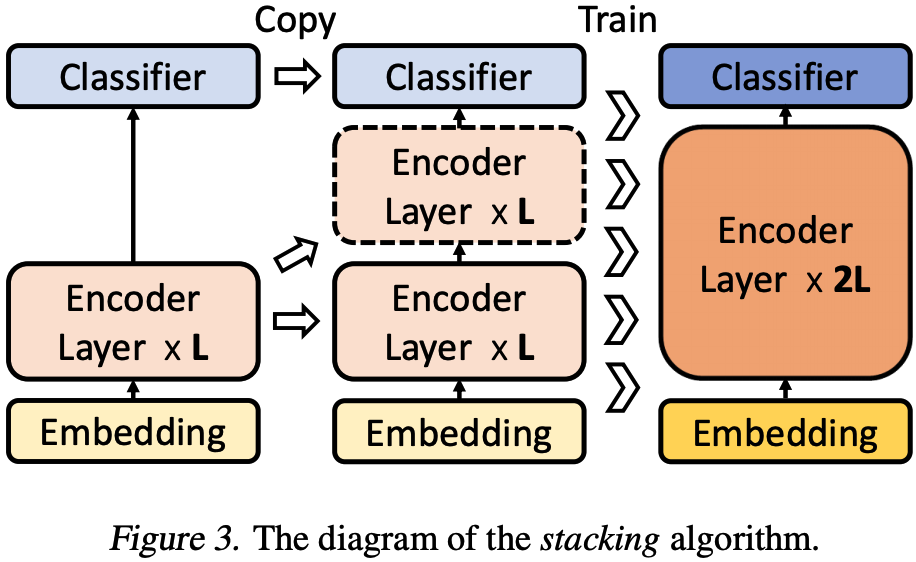

### NLP topics at ICML 2019

> This file functions as a paper buffer or further focused survey of certain topics.

* [Word representations](#word-representations)
* [Decoding in seq2seq](#decoding-in-seq2seq)
* [Pre-training LMs and generation](#pre-training-LMs-and-generation)
* [Architectural-innovations](#architectural-innovations)

####Word representions

[1] [Understanding the Origins of Bias in Word Embeddings](https://arxiv.org/pdf/1810.03611.pdf), Richard Zemel's group.

[2] [Humor in Word Embeddings: Cockamamie Gobbledegook for Nincompoops](https://arxiv.org/pdf/1902.02783.pdf), Adam Tauman Kalai's group at Microsoft Research.

[3] [Analogies Explained: Towards Understanding Word Embeddings](https://arxiv.org/pdf/1901.09813.pdf), Carl Allen and Timothy Hospedales at Edinburgh Univ.

---

- [1]

  **TL; DR**

  > This paper try to understand how bias in the learned word embedding arises from an experience (training data)-oriented point of view (reminding me of Influence Functions).  Their proposed technique can explain how a perturbed version of the training corpus can affect the moving of bias, i.e. they can identify how to remove the bias by removing certain subset of the training set.

  Specifically, given a metric to measure bias and the training corpus, their novel method can accurately identify certain subset of the corpus, once removed can affect the resulting bias. They decompose the problem of determining how the removal of a training subset affect the bias into two cascaded factors:

  - how the removal of a training subset affect change of the embedding vectors?
  - how the change of the embedding vectors affect the bias metric?

  Their proposed method is highly efficient to quantify the impact of each document (each training instance) in the training corpus with respect to bias metric. So possible applications might be: a selective corpus pruning method for reduing certain (gender) bias.

  **Tech. contribution**

  They formalize the problem of understanding origin of word embedding bias through the lens of two mathematical objects:

  1. Differential bias: the change of word embedding $$w$$ by removing certain document $$p$$: $$\Delta_p B = B(w) - B(\tilde{w})$$, where $$B$$ is the bias measurement metric;
  2. Bias gradient (specially derived for GloVe embedding method)

  Use *influence function* to measure how $$w$$ change affect $$B$$'s change by removing certain $$p$$.

  

- [2]

  **TL; DR**

  > This paper conducts an exploratory investigation on the relationship between word embeddings and human (single word) humor with the guidance of humor theories. Specifically, they find that single-word humor can be captured by word embeddings in a linear manner (certain linear directions are correlated to humor).

- [3]

  **TL; DR**

  > This paper gives a first practical (probabilistic) theory on the phenomenon of linearity of word embeddings for analogies, such as "woman is to queen as man is to king". Since this linear relationship is interpretable by human (the concept of "royal" plus "man" equals "king" as the previous example shows), so they can formalize the transformation from "man" to "king" using another embedding through additive relationship. This is formalised through the concept of *paraphrasing* and are used to interpret all the linear relationship emerges under PMI factorization-based embedding methods (word2vec and GloVe).

#### Decoding in seq2seq

[1] [Empirical Analysis of Beam Search Performance Degradation in Neural Sequence Models](http://proceedings.mlr.press/v97/cohen19a/cohen19a.pdf), Univ. of Toronto.
[2] [A Fully Differentiable Beam Search Decoder](http://proceedings.mlr.press/v97/collobert19a/collobert19a.pdf), FAIR.

[3] [Trainable Decoding of Sets of Sequences for Neural Sequence Models](http://proceedings.mlr.press/v97/kalyan19a/kalyan19a.pdf), GeoTech & FAIR.

[4] [Mixture Models for Diverse Machine Translation: Tricks of the Trade](https://arxiv.org/pdf/1902.07816.pdf), MIT & FAIR.

---

#### Pre-training LMs and generation

[1] [MASS: Masked Sequence to Sequence Pre-training for Language Generation](https://arxiv.org/pdf/1905.02450.pdf), Tie-Yan Liu's group.

[2] [Deep Residual Output Layers for Neural Language Generation](https://publications.idiap.ch/downloads/papers/2019/Pappas_ICML_2019.pdf), Idiap Research Institute, Martigny, Switzerland.

[3] [MeanSum: A Neural Model for Unsupervised Multi-Document Abstractive Summarization](https://arxiv.org/pdf/1810.05739.pdf), Google Brain.

[4] [Almost Unsupervised Text to Speech and Automatic Speech Recognition](https://arxiv.org/pdf/1905.06791.pdf), Tie-Yan Liu's group.

[5] [BERT and PALs: Projected Attention Layers for Efficient Adaptation in Multi-Task Learning](https://arxiv.org/pdf/1902.02671.pdf), Iain Murray's group.

[6] [Efficient Training of BERT by Progressively Stacking](https://proceedings.mlr.press/v97/gong19a/gong19a.pdf), Tie-Yan Liu's group.

[7] [Parameter-Efficient Transfer Learning for NLP](https://arxiv.org/pdf/1902.00751.pdf), Google Research.

[8] [Improving Neural Language Modeling via Adversarial Training](http://proceedings.mlr.press/v97/wang19f/wang19f.pdf), UT Austin.

---

- [1]

  **TL; DR**

  > Instead of applying the masked training methods to the holistic model (not distinguishing enc. and dec.) like BERT on *unconditional* pre-training, this paper focuses on adopting the pre-training approach to *conditional* language generation models, i.e. the encoder-decoder architecture. Specifically, they propose MASS (MAsked Seq2Seq learning), i.e. masked encoder input for encoding to be predicted by the decoder. The purpose of MASS is to make zero-/low-resource generation tasks like NMT to benefit from current popular pre-training paradigm.

  
  
  **MASS**
  
  The authors introduce a novel unsupervised prediction task for seq2seq pre-training. Given an unpaired source sentence $$x \in \mathcal{X}$$, we denote $$x^{\setminus u:v}$$ as a modified version of $$x$$ where its fragment from position $$u$$ to $$v$$ are masked. We replace each masked token by a special symbol $$[\mathbb{M}]$$, and the length of the masked sequence is not changed.
  
  $$
  \begin{align}
  \mathcal{L}(\theta; \mathcal{X}) &= \frac{1}{\vert\mathcal{X}\vert} \sum_{x \in \mathcal{X}} \log P(x^{u:v} \vert x^{\setminus u:v}) \\
  &= \frac{1}{\vert\mathcal{X}\vert} \sum_{x \in \mathcal{X}} \log \Pi_{t=u}^{v} P(x^{u:v}_t \vert x^{u:v}_{<t}, x^{\setminus u:v}; \theta)
  \end{align}
  $$
  
  **Other baselines**
  
  
  
  - Mask only one position instead of a continuous fragment;
  - Standard LM objective with encoder input as a sequence mask symbols;
  
  
  
  They also had an experiments on how to set the $$k$$ in their paper, it seems that 40%-50% should be the best choice.
  
  **Pre-training detail**
  
  "We mask the fragment by replacing the consecutive tokens with special symbols MASK, with random start position $$u$$. [...] The masked tokens in the encoder will be a MASK token 80% of the time, a random token 10% of the time and unchanged 10% of the time."
  
  > **Questions.**
  >
  > 1. Why should the $$k$$ words be continuous?
  > 2. Why should $$k$$ be fixed?
  > 3. What is the learned representation of the special MASK symbol?

- [2]

  **TL; DR**

  > This paper proposes an architectural choice for the softmax layer (log-linear classifier as the paper names) to learn the structure of the output space for NLM, NMT etc. This work can be a good review on the topic of output classifier layer design. And the main question the paper asks is: "by simply increasing the power of the label mapping while using a single softmax function without modifying its dimensionality or rank".
  >
  

**The literature survey**

- **Weight tying**: learning the structure of the output space *can be* helped by learning it jointly with the structure of input word embeddings; "but this still does not support the transfer of learned information across output labels."
    - $$\text{W} = \text{E}^T$$
    - $$P(y_t \vert y_{1}^{t-1}) \propto \exp (\text{E} h_t + b)$$
  - **Bilinear mapping**: $$P(y_t \vert y_{1}^{t-1}) = \exp (\text{E}_l \text{W} h_t + b)$$
  - **Dual non-linear mapping**:
    - $$P(y_t \vert y_{1}^{t-1}) \propto (\sigma(\text{E}\text{U} + b_u) \sigma(\text{V}h_t + b_v) + b)$$
    - $$\text{U}$$ and $$\text{V}$$ will project hidden size $$d$$ into $$d_j$$.
  

**Limitations for current label representation modeling**

- a. shallow modelling of the label space
  - b. tendency to overfit (i don't buy these two cents)
  

**Deep residual output layers**

  

  >**Caveat.** I think this paper is bullshit!!!
- [3]

- [4]

  **DL; DR**

  > This paper could be seen as applying the classic unsupervised NMT techniques to ASR. Their pipelined solution consists of: (1) a denoising auto encoder; (2) data augmentation from TTS model; (3) bidirectional modeling (actually also use right-to-left model for data augmentation); (4) holistic model (no encoder/decoder separation).

  **Very poor ablation**

  

- [5]

- [6]

  **TL; DR**

  > This paper actually motivated from a phenomenon of the self-attention pattern in BERT, which shows that self-attention weights are sharp nearby and fuzzy (very small) far away. This motivates the authors to come-up with a progressive training of BERT, that is, to train $$2^i$$ layers during the $$i$$-th iteration of training, which shows advantage of convergence speed than original training of all layers from scratch.

  **Training algorithm**

  

  

  The training algorithm is illustrated and shown in the above figures.

  **Two important questions**

  1. What is their motivation? Does it make sense?
  2. How they measure the training efficiency?

  For 1,

  For 2,

- [7]