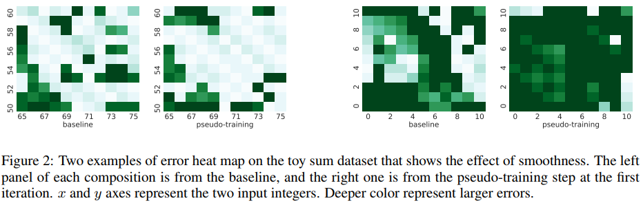

* [Interpretability](#interpretability)
* [NMT and generation](#nmt-and-generation)
* [Transformer variants](#transformer-variants)
* etc.

#### Interpretability

[1] [Learning from Explanations with Neural Module Execution Tree](https://openreview.net/forum?id=rJlUt0EYwS), Xiang Ren, Zhiyuan Liu's group.

[2] [Towards Hierarchical Importance Attribution: Explaining Compositional Semantics for Neural Sequence Models](https://openreview.net/forum?id=BkxRRkSKwr), Xiang Ren's group.

[3] [EDUCE: Explaining Model Decisions Through Unsupervised Concept Extraction](https://openreview.net/pdf?id=S1gnxaVFDB), 

[4] [On Identifiability in Transformers](https://openreview.net/forum?id=BJg1f6EFDB), 

---

#### NMT and Generation

[1] [The Curious Case of Neural Text *De*Generation](https://openreview.net/pdf?id=rygGQyrFvH), Yejin Choi's group.

[2] [Variational Template Machine for Data-to-Text Generation](https://openreview.net/forum?id=HkejNgBtPB), ByteDance Lei Li's group.

[3] [Data-dependent Gaussian Prior Objective for Language Generation](https://openreview.net/forum?id=S1efxTVYDr), Hai Zhao, Rui Wang's group.

[4] [Mirror-Generative Neural Machine Translation](https://openreview.net/forum?id=HkxQRTNYPH), Shujian Huang's group.

[5] [Editable Neural Networks](https://openreview.net/pdf?id=HJedXaEtvS), Yandex.

[6] [Encoding word order in complex embeddings](https://openreview.net/forum?id=Hke-WTVtwr), Tianjin Univ.

[8] [A Probabilistic Formulation of Unsupervised Text Style Transfer](https://openreview.net/forum?id=HJlA0C4tPS), Graham Neubig's group.

[9] [Cross-lingual Alignment vs Joint Training: A Comparative Study and A Simple Unified Framework](https://openreview.net/forum?id=S1l-C0NtwS), Graham Neubig's group.

[10] [Massively Multilingual Sparse Word Representations](https://openreview.net/forum?id=HyeYTgrFPB), Gábor Berend.

[11] [Residual Energy-Based Models for Text Generation](https://openreview.net/forum?id=B1l4SgHKDH), Facebook.

[12] [Decoding As Dynamic Programming For Recurrent Autoregressive Models](https://openreview.net/forum?id=HklOo0VFDH), Trevor Cohn's group.

[13] [Understanding Knowledge Distillation in Non-autoregressive Machine Translation](https://openreview.net/forum?id=BygFVAEKDH), Jiatao Gu's group.

[14] [Revisiting Self-Training for Neural Sequence Generation](https://openreview.net/forum?id=SJgdnAVKDH), Jiatao Gu's group.

---

- [1]

  **TL; DR**

  > This paper focuses on investigating the problem of current commonly used decoding strategy, i.e. the maximization-based decoding methods such as beam search. They *identify* an interesting phenomenon of **de**generation, that is, "the output text that is bland, incoherent, or get stuck in repetitive loops". As a remedy, they propose **nucleus sampling** which truncates unreliable words in vocabulary and relies on a dynamic nucleus of words that containing the majority of prob. mass at each decoding step. The most shinning analyses are: i) a comparison of human generated text and maximization-based decoded text w.r.t. model score at each time-step, which is very different; ii) the identification of unreliable tail of words;

  

  **Motivation**

  As shown in Figure 1 (caveat: maybe cherry picking) above, with one of the most powerful GPT2-117M model, two strategies of decoding: i) beam search; ii) pure random sampling; both lead to surprising de-generation:

  - beam search: repetition problem.
  - pure sampling from softmax outputs: non-sense, incoherent content.

  Reasons:

  - **Maximization-based decoding** does generate text with great quality and is very readable; however, the highest-scored sequence might be frequently appeared due to the aim of decoding is to maximize scores; rich gets richer issue.
  - **Pure sampling** might visit unreliable tokens in vocab. which have relatively very low probability aka. the tail tokens.

  

- [2]

  **TL; DR**

  > This paper focuses on a specific data-to-text problem, namely table-to-text, and targets at alleviating the diversity problem of the traditional encoder-decoder framework. The authors find templates crucial for improving variations of sentence structure. They propose two problems of VAE based text generation method: i) non-trivial to sample different templates; ii) hard to learn informative template space. So they propose VTM to enable generating sentences with diverse templates while preserving high quality with two latent variables for disentangled effects on the outputs. They also design a variational BT process for training on raw text. Together with sufficient experiments on two datasets, their methods can generate more diverse outputs with preserved quality.
  >
  > "an open set of templates is crucial for enriching the phrase constructions and realizing various generations" and "learning such templates is prohibitive since it often requires a large paired <table, description> corpus"; so this paper explores the problem of automatically learning reusable  templates from paired and *non-paired* data via variational template machine. Their proposed VTM disentangles template and semantic content in the latent space, and can be trained with raw text data without corresponded table information.

  **Modelling**

  - $$\mathcal{D}_p = \{ (x_i, y_i) \}_{i=1}^{N}$$: table-text pairs

  - a table can be viewed as a set of $$K$$ records of field-position-value triples, i.e. $$x = \{ (f, p, v)_i \}_{i=1}^K$$

    - this clear distinguished representation is used for deriving embeddings of each element, i.e. $$e_f, e_p, e_v \in \mathbb{R}^d$$ for further computing $$h_i = \text{tanh}(W [e_f, e_p, e_v] + b) \in \mathbb{R}^{d_t}$$; so $$h_i$$ is the representation of a record
    - the final representation of the table is through max-pooling across the $$d_t$$ dimensions among the $$K$$ records: $$f_{enc}(x) = h = \text{MaxPool}_i \{ h_i; i=1 \dots K \}$$

  - $$\mathcal{D}_r = \{ y_i \}_{i=1}^M$$: raw text

  - Latent variables in VTM

    - $$z$$: sentence template information

    - $$c$$: content

      > "The two latent variables are disentangled, which makes it possible to generate diverse and relevant sentences by sampling template variable and retaining the content variable"

  - Two training scenarios: supervised & unsupervised

    - $$\log p(y \vert x) = \int_c \int_z p(y, c, z \vert x) = \int_c \int_z p(y \vert x, c, z) p(c, z \vert x) = \int_c \int_z p(y \vert x, c, z) p(c \vert x) p(z)$$
    - 

  **Experimental results**

  

  > I don't think this paper is a good paper, since as a very basic baseline VAE, they didn't compare their model with it. Furthermore, there are many tricks to make their method work: as the preserving-template/preserving content loss indicate. 

- [3]

  **TL; DR**

  > This paper propose a third issue (theoretically and practically) of MLE training for seq2seq model with directed fully connected label dependency (i. exposure bias, train/test mismatch; ii. *de*generation with low diversity), that is the unawareness of label similarity. Specifically, at each time-step, MLE only maximizes the likelihood of the token in the reference $$y_t = v$$ without considering the different level of impossibility of other tokens $$v' \in \mathcal{V}, v' \neq v$$ in the vocabulary, i.e. $$v'$$ similar to $$v$$ should be less unlikely to avoid than $$v'$$ very different from $$v$$. So the author propose to add another regularization term for every step of MLE loss, $$p(y_t = v \vert x, y_{<t})$$, that is a KL divergence between $$p(\cdot \vert x, y_{<t})$$ and a prior $$p(\cdot \vert y_t=v)$$ which penalizes the entries in $$p(\cdot \vert x, y_{<t})$$ if the corresponding token are far different from $$v$$. This prior has a very simple form as $$p(v' \vert y_t=v) = \frac{\exp(f(v', v))}{\sum_{v'' \in \mathcal{V} \setminus v} \exp(f(v'', v))}$$, where $$f(v', v)$$ is a Gaussian kernel. This simple term gives reasonable improvement over very strong baseline among all kinds of language generation tasks.

  **Negative diversity ignorance**

  "MLE fails to assign proper scores to different incorrect model outputs, which means that all incorrect outputs are treated equally during training."

  *negative diversity ignoranc*e is a result of unfairly downplaying the nuance of sequences' detailed token-wise structure.

  > This problem cannot be solved without sampling from the model, or can be solved by sampling from another conditional $$P(\tilde{y} \vert y)$$, where $$y \in \mathcal{D}^{tr}$$.
  >
  > The relationship between exposure bias and negative diversity ignorance should be re-thought and made clear.

- [5]

  **TL; DR**

  > This paper focuses on reliable development of deep models with an error correction mechanism: how to easily correct the error of the neural model on a single input without changing predictions on the other inputs (without decreasing overall performance). It employs modern meta-learning techniques (maml) to ensure that "model's mistakes can be corrected without harming its overall performance."

  **Connections**

  - meta-learning: editable neural networks also belong to the meta-learning paradigm, as they basically "learn to allow effective patching"
  - catastrophic forgetting: since effective model patching should not degrade the performance of old training examples, this resembles the situation in continual learning
  - adversarial training: editable training could be used to cover the adversarial situations in model training like adversarial training, that is the mode is learning to be easily corrected for adversarial examples

  **Editing Neural Networks**

  The training scheme is shown in Figure 1.

  

  > **Core idea.**
  >
  > enforce the model parameters $$\theta$$ to be "prepared" for the editor function.

  - Editor function: $$\hat{\theta} = Edit(\theta, l_e)$$

  - $$l_e = \max_{y_i} \log p(y_i \vert x, \hat{\theta}) - \log p(y_{ref} \vert x, \hat{\theta})$$

  - Here, we aim to change model's prediction on a subset of inputs, corresponding to misclassified objects, without affecting other inputs

  - The three natural requirements of the editor function:
    - Reliability: the editor must guarantee $$l_e(\hat{\theta}) \leq 0$$ for the chosen family of $$l_e(\cdot)$$;
    - Locality: the editor should minimize influence on $$f(\cdot, \hat{\theta})$$ outside of satisfying $$l_e(\hat{\theta}) \leq 0$$;
      - $$f(x, \hat{\theta})$$ is the neural classifier or other neural predictive models;
      - Formally: $$\mathbb{E}_{x \in X_c} \#[f(x, \theta) \neq f(x, \hat{\theta})]$$
      - where $$X_c$$ is a control set for which the model's predictions should not change
    - Efficiency: the editor should be efficient in terms of runtime and memory;
    
  - The objective function of learning to correct is as follows:

    $$Obj(\theta, l_e) = \mathcal{L}_{base}(\theta) + c_{edit} \mathcal{L}_{edit}(\theta) + c_{loc} \mathcal{L}(\theta)$$

    - $$\mathcal{L}_{edit}(\theta) = \max(0, l_e(Edit^k_{\alpha}(\theta, l_e)))$$
    - $$\mathcal{L}_{loc}(\theta) = \mathbb{E}_{x \sim p(x)} KL(p(y \vert x; \theta) \vert\vert p(y \vert x, Edit^k_{\alpha}(\theta, l_e)))$$
    - etc.

  **Experiments**

  Three measures for evaluation:

  - **Drawdown**: mean absolute error difference;
  - **Success rate**: under $$k=10$$ gradient updates, can $$l_e$$ becomes less than 0;
  - **Num. steps**: an average of gradient steps needed to perform a single edit;

  An inconvincing experiment on IWSLT14 De-En machine translation.

  

  We don't know where does the drawback calculated. My guess is they measure the error correction performance on certain subset of test with very low BLEU score.

- [6]

  **TL; DR**

  > This paper focuses on solving the current drawback of position embeddings for modeling sequential or order information for natural language text. They think the drawback is

- [11]

  **TL; DR**

  > This paper propose an energy formulation/parameterization of LM directly constructed from an autoregressive LM by learning its residual in an MLE manner. Since exact MLE training is intractable due to the partition function, so noise contrastive estimation is used as a variant of MLE training. For **evaluation** using likelihood (PPL), due to the intractable computation of the partition function, the authors develop an upper and lower bounds (which have great asymptotic property) of the partition function and compute the approximate likelihood based on that. For **generation** from the residual energy model, they propose a so-called *top-k autoregressive sampling* methods for generation in an autoregressive (-_-) manner.

  **Model and training**

  $$P_\theta (x_{p+1}, \dots, x_T \vert x_1, \dots, x_p) = \frac{P_{LM}(x_{p+1}, \dots, x_T \vert x_1, \dots, x_p) \exp (-E(x_1, \dots, x_T))}{Z_\theta (x_1, \dots, x_p)}$$

  - $$x_1, \dots, x_p$$ is a conditional prefix

  - $$P_\theta$$ is called the joint model

  - $$E_\theta$$ is residual energy function and $$P_{LM}$$ is fixed during training

    > "The goal of training is to learn the parameters of the energy function such that the joint model distribution gets close to the data distribution"

  Training is through NCE (binary classification) with the objective as follows:

  $$\max \mathbb{E}_{x_{+} \sim P_{data}} \log \frac{1}{1 + \exp(E_\theta(x_{+}))} + \mathbb{E}_{x_{-} \sim P_{LM}} \log \frac{1}{1 + \exp(-E_\theta(x_{-}))}$$

  - first term: positive class's probability in logistic regression;
  - second term: negative class's probability in logistic regression;

  **Parameterization**

  Two variants are considered both are based on the self-attention architecture.

  - **UNIT**: single direction model, with all steps' last layers' hiddens mean-pooled and then project to get an energy score; causal Transformer;
  - **BIT**: bidirectional model; RoBERTa-base;
  - 64GPU (V100) for training using Adam.

  **Evaluating upper/lower bound of the partition**

  The form of the partition function:

  $$Z_\theta = \sum_{x} P_{LM}(x) \cdot \exp(-E_\theta (x)) = \mathbb{E}_{x \sim P_{LM}} \exp(-E_\theta(x))$$

  > **Theorem 2.**
  >
  > Denote $$T_n$$ as the empirical estimate of $$\log \mathbb{E}_{x \sim P_{LM}} \exp(-E(x))$$ with $$n$$ samples $$x_i \sim P_{LM}, (i=1, \dots, n)$$, and let $$T_n = \log \frac{1}{n} \sum_{i=1}^n \exp(-E(x_i))$$, then $$\forall \epsilon > 0, \exists N > 0$$ such that $$\forall n > N$$ we have:
  >
  > $$Z_\theta - \epsilon < \mathbb{E}[T_n] < Z_\theta < \mathbb{E}[(2n - 1)T_n - 2(n-1)T_{n-1}] < Z_\theta + \epsilon$$

  **Generation**

  Proposal LM sampling, then rescoring using the learned energy.

  

  **Main results**
  

- [12]

  **TL; DR**

  > This paper focuses on the problem of beam search based greedy decoding which is prone to error propagation and myopic decision without accounting for future steps. The authors apply the method of auxiliary coordinates to approximately search for best scoring hypothesis with discrete and continuous factors as a graphical model with DP-based solution. Their experiments are on the task of text infilling on SWAG and Daily Dialogue datasets.

  **Motivation**

  No exact decoding in ARM (auto-regressive models) due to non-decomposable long-range inter-dependencies among the output variables.

  **Method**

  [Could not fully understand]

  

  **Results**

  

  Ensemble improves the most.

- [14]

  **TL; DR**

  > This paper proposes a novel investigation on the working mechanism of self-training (mono-lingual data) for sequence prediction tasks like summarization, neural machine translation. They find that instead of the decoding strategy which plays a role for the improvement, most of the improvement comes from the hidden states' dropout mechanism when learning from self-training corpus. Based on this observation, they also propose noisy self-training to further enhance the randomness of learning from both real and psudo-augmented data. Final realistic experiments on NMT and summarization show significantly improvements. The most interesting analyses of this paper is on how to control all training variables and give evidence to the effectiveness of dropout mechanism in self-training.

  **Self-training: the basics**

  

  **Self-training settings**

  - psudo-training (PT): training on the augmented psudo-corpus;

    $$\mathcal{L}_{U} = - \mathbb{E}_{x \sim p(x)} \mathbb{E}_{y \sim p_{\theta^*}(y \vert x)} \log p_{\theta}(y \vert x)$$

  - fine-tuning (FT): after psudo-training, finetuned on real parallel corpus.

  

  Self-training under more than one repetition, the gain is significant!

  

  It is interesting to see that continue training from baseline can even be worse than training from scratch. Here, the author gives an explanation which I think is not convincing:

  

  > **Comment.**
  >
  > The argument of training trajectory changing is very hard to guarantee. And the

  

  beam search > sampling

  w/ dropout >> w/o dropout

  **An interesting experiments on proving effectiveness of dropout**

  The authors construct a toy seq2seq task for investigating the smoothing effect of dropout.

  - Task: adding two integers

    

  

  - $$\vert f(x_1, x_2) - f(x_1', x_2') \vert$$, where $$x_1, x_2$$ changed locally (the $$3 \times 3$$ board as shown in Figure 2), the standard deviation is summarized in Table 3.

  **Experiment on larger datasets**

  

  

- [13]

  **TL; DR**

  > 

#### Language Models

[1] [Mixout: Effective Regularization To Finetune Large-scale Pretrained Language Models](https://openreview.net/forum?id=HkgaETNtDB), Kyunghyun Cho's group.

[2] [Are Pre-trained Language Models Aware Of Phrases? Simple But Strong Baselines For Grammar Induction](https://openreview.net/forum?id=H1xPR3NtPB), Seoul National University.

---

- [1]

- [2]

  **TL; DR**

  > The authors propose simple methods for extracting constituent parse tree without training from a pre-trained LM. The extraction mechanism is based on syntactic distance between two adjacent words, where the distance is derived from the hidden representations of the two words and the attention score.

  **Motivation & intuition**

  Motivations are threefold:

  - directly extract constituency parse from a pre-trained LM can enable us to derive strong baselines for grammar induction;
  - facilitates an analysis on how much and what kind of syntactic information each pre-trained LM contains;
  - it allows us to easily inject biases (right-skewness) into the proposed framework for improved performance;

  Intuitions are:

  - the observation that we can cluster words in a sentence according to the similarity of their attention distributions over words in the sentence;

  > This paper's related work gives a exhaustive summary of recent advances in unsupervised grammar induction.

  **Proposed method**

  A sequence of words $$w_1, w_2, \dots, w_n$$ to compute $$\mathbb{d} = [d_1, d_2, d_{n-1}]$$ where $$d_i$$ corresponds to the syntactic distance between $$w_i$$ and $$w_{i+1}$$. Each $$d_i$$ is defined as:

  $$d_i = f(g(w_i), g(w_{i+1}))$$

  - $$f(\cdot, \cdot)$$ is a distance measure between the two feature vector;
  - $$g(\cdot$$ is a feature extractor for the word;

  > Although previous studies attempted to explicitly train the functions $$f, g$$ in a supervised or unsupervised way, this work sticks to simple distance metric functions for $$f$$ and pre-trained LMs for $$g$$.

  Each LM provides two kinds of feature extractor:

  - $$G^v$$

  

  

- etc.

#### Transformer Variants

[1] [Reformer: The Efficient Transformer](https://openreview.net/forum?id=rkgNKkHtvB), UCB and Google.

[2] [Compressive Transformers for Long-Range Sequence Modelling](https://openreview.net/forum?id=SylKikSYDH), Google.

[3] [Monotonic Multihead Attention](https://openreview.net/forum?id=Hyg96gBKPS), Jiatao Gu's group.

---

- [1]

  **TL; DR**

  > This paper aims at making the SOTA seq2seq architecture, Transformer, more computational efficient. The authors propose two efficiency improvements with respect to the i) attention computation and ii) training time activation storage.

  **Some statistics w.r.t. computational cost**

  - $$N$$ layers require store $$N$$ activation vectors for BP

  - 0.5B parameters cost 2GB GPU memory
  - attention on sequences of length $$L$$ is $$O(L^2)$$ in both computational and memory complexity

  **How they do as a remedy**

  - Reversible layers, enables storing only a single copy of activations in the whole model, so the $$N$$ factors disappears.
  - Splitting activations inside feed-forward layers and precessing them in chunks removes the $$d_{ff}$$ factors and saves memory inside feed-forward layers.
  - Approximate attention computation based on locality-sensitive hashing reduces $$O(L^2)$$ to $$O(L)$$.

  > **My biggest question.**
  >
  > How to implement their mechanism in code? Does they be implemented on top of PyTorch or TensorFlow?

  **LSH attention**

  - Shared $$QK$$, $$\text{softmax}(\frac{Q K^T}{\sqrt{d_k}}) V$$, the main issue is the $$QK^T$$ term;

  - The intuition: for every query $$q_i$$, we only need to focus on the keys in $$K$$ that are closest to $$q_i$$ $$\Rightarrow$$ so we can only compute attention dot products for a small subset of $$length$$ keys, the $$k$$-nearest neighbor of $$q_i$$;

  - The problem of finding nearest neighbors quickly in high-dim spaces can be solved by LSH;

    > "In our case, we actually only require that nearby vectors get the same hash
    > with high probability and that hash-buckets are of similar size with high probability."

  

  

  The above figures shows how to construct hashes for the queries, and how to apply attention only in chunk for parallel attention calculation;

  - etc.
  - 

- [2]

#### Compositionality

[1] [Measuring Compositional Generalization: A Comprehensive Method on Realistic Data](https://openreview.net/forum?id=SygcCnNKwr), Google.

[2] [Towards Hierarchical Importance Attribution: Explaining Compositional Semantics for Neural Sequence Models](https://openreview.net/forum?id=BkxRRkSKwr), Xiang Ren's group.

[3] [Compositional languages emerge in a neural iterated learning model](https://openreview.net/forum?id=HkePNpVKPB), Shay Cohen's group.

[4] [Compositional Continual Language Learning](https://openreview.net/forum?id=rklnDgHtDS), Kenneth Church's group.

[5] [Permutation Equivariant Models for Compositional Generalization in Language](https://openreview.net/forum?id=SylVNerFvr), David Lopez-Paz's group.

[6] [Locality and Compositionality in Zero-Shot Learning](https://openreview.net/forum?id=Hye_V0NKwr), Google and Microsoft.

#### Evaluation

[1] [BERTScore: Evaluating Text Generation with BERT](https://openreview.net/forum?id=SkeHuCVFDr), UW.

[2] [Language GANs Falling Short](https://openreview.net/forum?id=BJgza6VtPB), MILA.

---

- [1]

  **TL; DR**

  > This paper propose a new automatic evaluation metric for text generation tasks with BERT. BERTScore computes a similarity between the generated hypos and the reference using contextual embeddings based on pairwise similarity matrix and a reweighing mechanism based on tf-idf. Extremely extensive experiment

  **Method**

  

  Given a reference sentence $$x = (x_1, \dots, x_k)$$ and a candidate sentence $$\hat{x} = (x_1, \dots, x_l)$$, we use contextual embeddings to represent the tokens, and compute matching using cosine similarity (unnormalized dot product), optionally weighted with inverse document frequency scores.
  - BERT for token level representation;
  - similarity measure: the use pre-normalized vectors, which reduce the cosine similarity to dot product;
  - BERTScore
    - Recall: $$R_{BERT} =  \frac{1}{\vert x \vert} \sum_{x_i \in x} \max_{\hat{x}_j \in \hat{x}} x_i^T \hat{x}_j$$
    - Precision: $$P_{BERT} = \frac{1}{\vert \hat{x} \vert} \sum_{\hat{x}_j \in \hat{x}} \sum_{\hat{x}_j \in \hat{x}} \max_{x_i \in x} \hat{x}_j^T x_i$$
    - $$F_{BERT} = 2 \frac{P_{BERT} \cdot R_{BERT}}{P_{BERT} + R_{BERT}}$$
  - Importance weighting:
    - $$\text{idf}(w) = - \log \frac{1}{M} \sum_{i=1}^M \mathbb{I}[w \in x^{(i)}]$$
    - $$R_{BERT} = \frac{\sum_{x_i \in x} \text{idf}(x_i) \max_{\hat{x}_j \in \hat{x}}x_i^T \hat{x}_j}{\sum_{x_i \in x} \text{idf}(x_i)}$$

  

  

  > **Comment.**
  >
  > - This paper is a great start point of surveying and thinking about traditional automatic evaluation metrics.
  > - I think continuous representation-based metric can be complemented with hard-string metric in RL-like training as reward.

- [2]

  **TL; DR**

  > This paper challenges previous conclusion that "exposure bias" has high correlation with poor sample quality in text generation tasks with MLE training. Since most of GAN-based works which improves quality (measured by BLEU) ignore the decreased diversity of the generated texts. The authors conduct experiments with MLE using the temperature sweeping technique to get good quality or nice diversity examples than GANs. And they establish a definitive *quality-diversity evaluation* procedure using temperature tuning over local and global sample metrics. The experimental results show exposure bias issue with MLE is less critical than instability of GAN-based training (non-differentiable metrics etc.).

  some comments:

  1. this paper directly argues that "exposure bias" is a well-known problem that has strong correlation with poor generation quality, without citing evidence papers.
  2. etc.

  **Current eval. dilemma**

  

  Diversity: the bigger the better

  Quality: the bigger the better

  => inverse, both smaller the better

  **Motivation**

  The observation that:

  > "lower temperature generate less diverse, high-quality samples; higher temperature increase the entropy of the distribution and produce more diverse, lower-quality samples. [...] By explicitly controlling the temperature we remove a potential source of bias (models may have different 'implicit' temperatures) and obtain a more complete understanding of each model's behavior."
  >
  > $$\Rightarrow$$
  >
  > Make evaluation more flexible with different constraints under different potential temperature.

  **Adversarial text generation**

  $$\mathcal{L} =  \min_\theta \max_\phi \mathbb{x \sim p_{data}}[\log D_\phi(x)] + \mathbb{E}_{x \sim G_\theta}[1 - \log D_\phi(x)]$$

  **Temperature sweep: towards robust NLG evaluation**

  

  - $$G_\theta (x_t \vert x_{1:t-1}) = \text{softmax}(o_t \cdot W / \alpha)$$